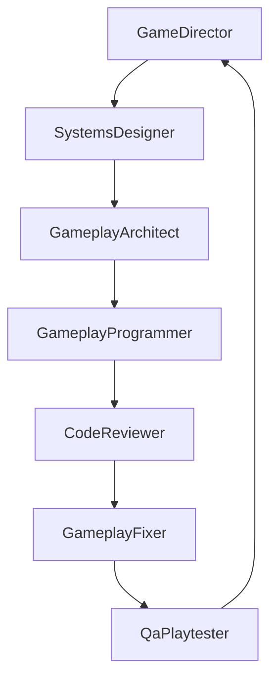

# Ivy Multi-Agent Pipeline

This document defines how gameplay work moves from idea to verified delivery.

## Stage Order

1. Game Director
2. Systems Designer
3. Gameplay Architect
4. Gameplay Programmer
5. Code Reviewer
6. Gameplay Fixer
7. QA Playtester

## Flow

## Stage Contracts

Every stage output must include:
- Inputs used
- Must produce section outputs
- Definition of done checks
- Handoff checklist completion
- Explicit non-goals

## Rework Rules

- If design intent is unclear, route back to Game Director.
- If mechanic rules are incomplete, route back to Systems Designer.
- If implementation plan is ambiguous, route back to Gameplay Architect.
- If code fails review, route to Gameplay Fixer.
- If QA fails, reopen fix loop (Fixer -> QA) and keep related issue open.

## Completion Criteria

Work is complete only when:
- Code Reviewer has no blocking findings
- QA Playtester has verified behavior against the epic's acceptance criteria
- The accept bead and epic are closed in bd (see `beads-acceptance.mdc`)
